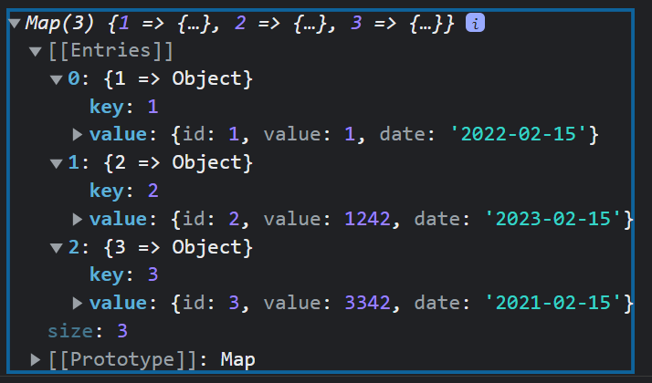

# JS Homework

Feel free to modify test data or add new data
It will help for better testing

## Get days in year

Return total days count

```javascript
getDaysInYear(year);

getDaysInYear(2021);
// 365
getDaysInYear(2020);
// 366
```

## Get day of a year

Return day number from date

```javascript
getDayNumber(date);

getDayNumber("2023-01-12");
// 12

getDayNumber("2023-02-26");
// 57
```

## Get fiscal quarters

Return quarter number from date  
I quarter: Jan - Mar  
II quarter: Apr - Jun  
III quarter: Jul - Sep  
IV quarter: Oct - Dec

```javascript
getQuarters(date);

getQuarters("2023-02-26");
// Feb 26 is I quarter
```

## Write a function to calculate date diff

Write a function to calculate date diff  
Return value should be a formated string  
If diff is less then hour use minutes format
If diff is less then day use hour and minute format  
If diff is less then month use days format
If diff is less then year use moth format
Everything else can be in years format

```javascript
calcDateDiff(startDate, endDate);

calcDateDiff("2023-02-26 14:00", "2023-02-26 14:20");
// 20 minutes

calcDateDiff("2023-02-26 14:00", "2023-02-26 15:30");
// 1 hours 30 minutes

calcDateDiff("2023-02-26 14:00", "2023-02-28 15:30");
// 2 days

calcDateDiff("2023-02-26 14:00", "2023-05-28 15:30");
// 3 months

calcDateDiff("2023-02-26 14:00", "2025-05-28 15:30");
// 2 years
```

## Create a map

Create map from array of objects  
Key should be id from object  
Please add more input data

```javascript
createMap(arr);

createMap([
  { id: 1, value: 1, date: "2022-02-15" },
  { id: 2, value: 1242, date: "2023-02-15" },
  { id: 3, value: 3342, date: "2021-02-15" },
]);
```


